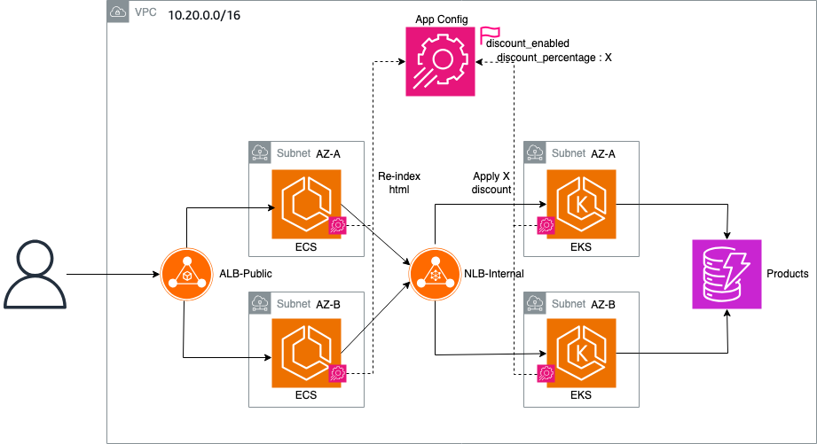

# Feature Toggles em ECS e EKS com AWS AppConfig (sidecar pattern)

Código de referência do blog **"Implementing Feature Toggles in Container Environments with AWS AppConfig"**
(texto completo em [`AWS_AppConfig_Feature_Toggle_Blog.md`](AWS_AppConfig_Feature_Toggle_Blog.md)).

Demonstra uma feature flag de **desconto promocional** controlada dinamicamente via
AWS AppConfig — sem rebuild ou redeploy dos containers — usando o **AppConfig Agent
como sidecar** em Amazon EKS e Amazon ECS (Fargate).

## Arquitetura



- **frontend** (Flask, porta 80) — renderiza o catálogo de produtos e destaca a promoção quando a flag está ativa.
- **backend** (Flask, porta 5000) — lê os produtos do DynamoDB e aplica o desconto quando a flag está ativa.
- **appconfig-agent** (sidecar, porta 2772) — cada pod/task expõe a configuração em `http://localhost:2772`; as apps só fazem um GET HTTP local.
- **AWS AppConfig** — guarda a feature flag `discount_enabled` (`enabled`, `discount_percentage`).
- **DynamoDB** — tabela `Products` com o catálogo.

## Estrutura do repositório

```
backend/            App Flask + Dockerfile (API de produtos)
frontend/           App Flask + Dockerfile + templates (catálogo)
eks/                Manifests Kubernetes (namespace, SA/IRSA, deployments com sidecar, services)
ecs/                Task definitions Fargate (backend e frontend, cada uma com o sidecar)
iac/template.yaml   CloudFormation: AppConfig + validator + deployment strategy + DynamoDB + IAM
scripts/            seed_products.py — popula o DynamoDB com dados de exemplo
```

## Pré-requisitos

- AWS CLI configurado (`aws configure`), região padrão `us-west-2`.
- Docker, e para EKS: `kubectl` + um cluster com o [AWS Load Balancer Controller](https://kubernetes-sigs.github.io/aws-load-balancer-controller/).
- Python 3.13 (apenas para rodar o script de seed localmente).

> Região padrão em todos os arquivos: **us-west-2**. Ajuste se necessário.

---

## Passo 1 — Provisionar a infraestrutura (AppConfig + DynamoDB + IAM)

```bash
aws cloudformation deploy \
  --template-file iac/template.yaml \
  --stack-name appconfig-feature-toggle \
  --capabilities CAPABILITY_NAMED_IAM \
  --region us-west-2

# Anote os outputs (IDs de AppConfig, ARN da role, nome da tabela)
aws cloudformation describe-stacks \
  --stack-name appconfig-feature-toggle \
  --query "Stacks[0].Outputs" --output table --region us-west-2
```

Para habilitar **IRSA no EKS**, passe o OIDC provider do seu cluster:

```bash
aws cloudformation deploy --template-file iac/template.yaml \
  --stack-name appconfig-feature-toggle --capabilities CAPABILITY_NAMED_IAM \
  --parameter-overrides \
      EksOidcProviderArn=arn:aws:iam::<ACCOUNT_ID>:oidc-provider/oidc.eks.us-west-2.amazonaws.com/id/<ID> \
      EksOidcProviderUrl=oidc.eks.us-west-2.amazonaws.com/id/<ID>
```

## Passo 2 — Popular o DynamoDB

```bash
pip install boto3
export AWS_DEFAULT_REGION=us-west-2
python scripts/seed_products.py Products
```

## Passo 3 — Build e push das imagens para o ECR

Crie os repositórios via IaC e faça o push. **Em Mac/ARM use `--platform linux/amd64`**
(Fargate roda amd64; sem isso a task falha com "exec format error"):

```bash
aws cloudformation deploy --template-file iac/ecr.yaml \
  --stack-name appconfig-demo-ecr --region us-west-2

ACCOUNT_ID=$(aws sts get-caller-identity --query Account --output text)
REGION=us-west-2
REG=$ACCOUNT_ID.dkr.ecr.$REGION.amazonaws.com
aws ecr get-login-password --region $REGION | docker login --username AWS --password-stdin $REG

for svc in backend frontend; do
  docker build --platform linux/amd64 -t ${REG}/${svc}:latest ./${svc}
  docker push ${REG}/${svc}:latest
done
```

## Passo 4a — Deploy no EKS

Substitua os placeholders `<ACCOUNT_ID>` nos manifests (imagem ECR e ARN da role IRSA
em [`eks/01-serviceaccount.yaml`](eks/01-serviceaccount.yaml)), depois:

```bash
kubectl apply -f eks/00-namespace.yaml
kubectl apply -f eks/01-serviceaccount.yaml
kubectl apply -f eks/10-backend-deployment.yaml
kubectl apply -f eks/11-backend-service.yaml
kubectl apply -f eks/20-frontend-deployment.yaml
kubectl apply -f eks/21-frontend-service.yaml

# URL pública do frontend
kubectl get svc frontend-service -n backend \
  -o jsonpath='{.status.loadBalancer.ingress[0].hostname}'
```

## Passo 4b — Deploy no ECS (Fargate) — recomendado

A stack [`iac/ecs.yaml`](iac/ecs.yaml) cria tudo: cluster, ALB público, security
groups, Service Connect (o frontend acha o backend via `http://backend:5000`),
task definitions com o sidecar e os dois services. Passe os outputs da foundation
stack e as subnets públicas da sua VPC:

```bash
REGION=us-west-2
ACCOUNT_ID=$(aws sts get-caller-identity --query Account --output text)
REG=$ACCOUNT_ID.dkr.ecr.$REGION.amazonaws.com

# IDs vindos dos outputs da foundation stack (Passo 1)
APP_ID=...; ENV_ID=...; CONFIG_ID=...
SUBNETS="subnet-aaaa,subnet-bbbb,subnet-cccc"   # subnets públicas da VPC
VPC_ID=vpc-xxxx

aws cloudformation deploy --template-file iac/ecs.yaml \
  --stack-name appconfig-demo-ecs --capabilities CAPABILITY_IAM --region $REGION \
  --parameter-overrides \
      VpcId=$VPC_ID SubnetIds=$SUBNETS \
      BackendImage=${REG}/backend:latest FrontendImage=${REG}/frontend:latest \
      AppConfigAppId=$APP_ID AppConfigEnvId=$ENV_ID AppConfigConfigId=$CONFIG_ID \
      TaskRoleArn=arn:aws:iam::${ACCOUNT_ID}:role/appconfig-feature-toggle-AppConfigAgentRole \
      ProductsTableName=Products AwsRegion=$REGION

# URL pública do frontend
aws cloudformation describe-stacks --stack-name appconfig-demo-ecs --region $REGION \
  --query "Stacks[0].Outputs[?OutputKey=='FrontendUrl'].OutputValue" --output text
```

> Os JSONs em [`ecs/`](ecs/) permanecem como referência standalone da task
> definition (útil para quem quer registrar manualmente ou entender o formato);
> o `iac/ecs.yaml` é o caminho automatizado.

## Passo 5 — Alternar a feature flag

No console do AWS AppConfig, edite a flag `discount_enabled` (defina `enabled = true`
e `discount_percentage`) e faça um **deployment** usando a strategy
`MyPythonApp-gradual-15min`. Em segundos os sidecars propagam a mudança e o catálogo
passa a exibir os preços com desconto — **sem redeploy de containers**.

Endpoints úteis:
- `GET /` (frontend) — catálogo.
- `GET /debug` (frontend) — inspeção de config/flag.
- `GET /api/status` e `GET /api/products` (backend).

## Configuração via variáveis de ambiente

| Variável | Serviço | Descrição |
|---|---|---|
| `APPCONFIG_APP_ID` | backend, frontend | Nome/ID da AppConfig Application |
| `APPCONFIG_ENV_ID` | backend, frontend | Nome/ID do Environment |
| `APPCONFIG_CONFIG_ID` | backend, frontend | Nome/ID do Configuration Profile |
| `AWS_DEFAULT_REGION` | backend, frontend | Região AWS |
| `DYNAMODB_TABLE_NAME` | backend | Nome da tabela de produtos (default `Products`) |
| `BACKEND_URL` | frontend | URL base do backend |
| `APPCONFIG_AGENT_BASE_URL` | backend | Endpoint do agent (default `http://localhost:2772`) |

## Limpeza

```bash
kubectl delete -f eks/ 2>/dev/null || true
aws cloudformation delete-stack --stack-name appconfig-demo-ecs        --region us-west-2
aws cloudformation wait stack-delete-complete --stack-name appconfig-demo-ecs --region us-west-2
# esvaziar os repos ECR antes de apagar a stack (ECR não deleta com imagens dentro)
aws ecr batch-delete-image --repository-name backend  --image-ids imageTag=latest --region us-west-2 2>/dev/null || true
aws ecr batch-delete-image --repository-name frontend --image-ids imageTag=latest --region us-west-2 2>/dev/null || true
aws cloudformation delete-stack --stack-name appconfig-demo-ecr        --region us-west-2
aws cloudformation delete-stack --stack-name appconfig-feature-toggle  --region us-west-2
```
