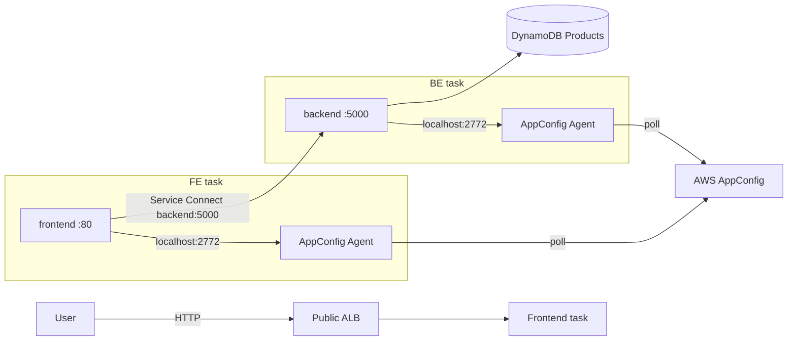

# Feature Flags for Containers (ECS & EKS) with AWS AppConfig


> Companion code for the AWS Containers Blog post **"Implementing Feature Flags in Container Environments with AWS AppConfig"**.

A complete, deployable reference project that adds **runtime feature toggles** to containers on **Amazon ECS** and **Amazon EKS** using the **AWS AppConfig Agent sidecar** — flip a flag in AWS AppConfig and every running task/pod picks it up in seconds, with no image rebuild and no container restart.

## Contents

- [Demonstration only](#demonstration-only)
- [The problem it solves](#the-problem-it-solves)
- [What's in this project](#whats-in-this-project)
- [Architecture](#architecture)
- [How it works](#how-it-works)
- [Prerequisites](#prerequisites)
- [Project layout](#project-layout)
- [Deploy](#deploy)
- [Toggle the feature flag](#toggle-the-feature-flag)
- [Verify](#verify)
- [API endpoints](#api-endpoints)
- [Example response](#example-response)
- [Key benefits](#key-benefits)
- [Security considerations](#security-considerations)
- [Cost](#cost)
- [Clean up](#clean-up)
- [Security](#security)
- [License](#license)

## Demonstration only

> ⚠️ This project is a **demonstration / learning sample**. It is intentionally
> simplified so readers can follow along and reproduce the setup. Specifically:
>
> - The **`/admin` portal** and **`/debug` endpoint** have **no authentication** —
>   they are open so you can toggle the feature flag and inspect configuration
>   without additional setup. **In a production environment**, protect these
>   endpoints with an authentication mechanism such as
>   [Amazon Cognito](https://docs.aws.amazon.com/cognito/),
>   [ALB authentication](https://docs.aws.amazon.com/elasticloadbalancing/latest/application/listener-authenticate-users.html),
>   or application-level auth middleware — or remove `/debug` entirely.
> - The Application Load Balancer uses a plain **HTTP** listener. Add an
>   [ACM certificate](https://docs.aws.amazon.com/acm/) for HTTPS in production.
> - IAM roles are scoped to this demo's resources, and services run with public
>   IPs in the default VPC. Use private subnets and tighter scoping in production.
> - Containers run as root for simplicity. Add a non-root `USER` directive in
>   Dockerfiles and `securityContext` in Kubernetes manifests for production.

## The problem it solves

Containers are immutable by design — changing application behavior traditionally means rebuilding and redeploying the image. Environment variables force task/pod restarts; mounting config from an external store pushes polling, caching, and credential logic into your code.

Feature flags decouple **behavior changes** from **deployments**. This project uses the AppConfig Agent sidecar so your application reads flags through a simple local HTTP call — no SDK, no polling logic, no credentials in your code — enabling instant rollouts, gradual rollouts with automatic rollback, A/B experiments, and production kill switches.

## What's in this project

| Component | Description |
|-----------|-------------|
| **Frontend** (Flask, port 80) | Renders the product catalog, highlights the promotion when the flag is on, and hosts the `/admin` toggle portal |
| **Backend** (Flask, port 5000) | Reads products from DynamoDB and applies the discount when the flag is on |
| **AppConfig Agent** (sidecar, port 2772) | Runs beside each container; exposes config at `http://localhost:2772`, polls AppConfig, caches, and degrades gracefully |
| **AWS AppConfig** | Stores the `discount_enabled` feature flag (`enabled`, `discount_percentage`) with a JSON-schema constraint (0–100) |
| **DynamoDB** | `Products` table (SSE + point-in-time recovery) with the sample catalog |
| **ECS Fargate + ALB + Service Connect** | Public ALB → frontend; frontend reaches backend internally via `http://backend:5000` |
| **Deployment strategies** | `gradual-15min` (linear, 5 min bake, for console demos) and `instant` (0 bake, for the `/admin` portal) |

## Architecture




Both containers carry the AppConfig Agent sidecar. When you flip `discount_enabled`, each agent picks up the new configuration on its next poll and serves it from its local cache — the backend applies the discount to prices and the frontend switches on promotional messaging, all without a redeploy.

## How it works

1. **Init** — on container start, the agent opens a session with AWS AppConfig and fetches the current configuration.
2. **Read** — on each request, the app makes a local `GET http://localhost:2772/applications/<app>/environments/<env>/configurations/<profile>` that returns in microseconds.
3. **Poll** — in the background the agent polls AppConfig every `POLL_INTERVAL` seconds (this project sets **30s**; the agent default is 45s) and transparently refreshes its cache.
4. **Toggle** — you change the flag (via the `/admin` portal or the AppConfig console); within one poll interval every task/pod reflects the change. No image rebuild, no restart.

## Prerequisites

- **AWS CLI v2**, configured (`aws configure` / `AWS_PROFILE`) — default region **us-west-2**
- **Docker** — on Mac/ARM, builds use `--platform linux/amd64` (Fargate runs amd64)
- **Python 3.13** — only to run the seed script locally (`pip install boto3`)
- For **EKS**: `kubectl` and a cluster with the [AWS Load Balancer Controller](https://kubernetes-sigs.github.io/aws-load-balancer-controller/)

## Project layout

```
backend/            Flask product API + Dockerfile
frontend/           Flask catalog UI + admin portal + Dockerfile + templates
ecs/                Standalone Fargate task definitions (backend, frontend), each with the sidecar
eks/                Kubernetes manifests (namespace, IRSA ServiceAccount, deployments, services)
iac/
  template.yaml     AppConfig + validator + deployment strategies + DynamoDB + IAM
  ecr.yaml          ECR repositories (scan-on-push, immutable tags, lifecycle policy)
  ecs.yaml          ECS cluster, public ALB, Service Connect, task definitions, services
scripts/
  seed_products.py  Populates the DynamoDB table with sample products
```

## Deploy

All commands assume `AWS_PROFILE` and `us-west-2`. The ECS path below is the recommended one-command-per-stack flow.

**1. Foundation — AppConfig + DynamoDB + IAM**

```bash
aws cloudformation deploy \
  --template-file iac/template.yaml \
  --stack-name appconfig-feature-toggle \
  --capabilities CAPABILITY_NAMED_IAM --region us-west-2

# Capture the outputs (AppConfig IDs, role ARN, strategy IDs)
aws cloudformation describe-stacks --stack-name appconfig-feature-toggle \
  --query "Stacks[0].Outputs" --output table --region us-west-2
```

**2. Seed DynamoDB**

```bash
pip install boto3
export AWS_DEFAULT_REGION=us-west-2
python scripts/seed_products.py Products
```

**3. Build and push images to ECR**

```bash
aws cloudformation deploy --template-file iac/ecr.yaml \
  --stack-name appconfig-demo-ecr --region us-west-2

ACCOUNT_ID=$(aws sts get-caller-identity --query Account --output text)
REGION=us-west-2
REG=$ACCOUNT_ID.dkr.ecr.$REGION.amazonaws.com

# Private ECR login (for push)
aws ecr get-login-password --region $REGION | docker login --username AWS --password-stdin $REG

# Public ECR login (for the python:3.13-slim base image pull) — see tip below
aws ecr-public get-login-password --region us-east-1 | docker login --username AWS --password-stdin public.ecr.aws

for svc in backend frontend; do
  docker build --platform linux/amd64 -t ${REG}/${svc}:latest ./${svc}
  docker push ${REG}/${svc}:latest
done
```

> 💡 **Tip:** logging in to your **private** ECR registry invalidates anonymous pulls from `public.ecr.aws`, so the base-image pull fails with `403 / authorization token has expired`. Authenticate to public ECR separately (its auth endpoint lives in **us-east-1**) as shown above.

**4. ECS (Fargate) — cluster, ALB, Service Connect, services**

```bash
REGION=us-west-2
ACCOUNT_ID=$(aws sts get-caller-identity --query Account --output text)
REG=$ACCOUNT_ID.dkr.ecr.$REGION.amazonaws.com

# From the foundation stack outputs (step 1)
APP_ID=...; ENV_ID=...; CONFIG_ID=...; INSTANT_STRATEGY=...   # InstantStrategyId
SUBNETS="subnet-aaaa,subnet-bbbb,subnet-cccc"                 # public subnets
VPC_ID=vpc-xxxx

aws cloudformation deploy --template-file iac/ecs.yaml \
  --stack-name appconfig-demo-ecs --capabilities CAPABILITY_IAM --region $REGION \
  --parameter-overrides \
      VpcId=$VPC_ID SubnetIds=$SUBNETS \
      BackendImage=${REG}/backend:latest FrontendImage=${REG}/frontend:latest \
      AppConfigAppId=$APP_ID AppConfigEnvId=$ENV_ID AppConfigConfigId=$CONFIG_ID \
      AppConfigDeployStrategyId=$INSTANT_STRATEGY \
      TaskRoleArn=arn:aws:iam::${ACCOUNT_ID}:role/appconfig-feature-toggle-AppConfigAgentRole \
      ProductsTableName=Products AwsRegion=$REGION

# Public frontend URL
aws cloudformation describe-stacks --stack-name appconfig-demo-ecs --region $REGION \
  --query "Stacks[0].Outputs[?OutputKey=='FrontendUrl'].OutputValue" --output text
```

> To provide **HTTPS**, pass `CertificateArn=<acm-arn>`; the ALB then serves 443 and redirects 80 → 443.

**4b. EKS (alternative)** — replace the `<ACCOUNT_ID>` placeholders (ECR image URI and IRSA role ARN) in [`eks/01-serviceaccount.yaml`](eks/01-serviceaccount.yaml), then `kubectl apply -f eks/` in numeric order. For IRSA, deploy the foundation stack with `EksOidcProviderArn` / `EksOidcProviderUrl` overrides.

## Toggle the feature flag

The sidecars propagate the change within one poll interval — no container redeployment.

- **Admin portal (recommended for demos):** open `http://<ALB-DNS>/admin`, check *Promotion active*, set the percentage, click **Apply**. The frontend calls the AppConfig control plane, creates a new hosted version, and triggers an instant (0-bake) deployment.
- **AppConfig console:** edit the `discount_enabled` flag and deploy with the `MyPythonApp-gradual-15min` strategy (gradual rollout with automatic rollback on CloudWatch alarms).

## Verify

```bash
URL=$(aws cloudformation describe-stacks --stack-name appconfig-demo-ecs --region us-west-2 \
  --query "Stacks[0].Outputs[?OutputKey=='FrontendUrl'].OutputValue" --output text)

curl -s -o /dev/null -w "%{http_code}\n" "$URL/"        # 200
curl -s "$URL/debug"                                     # config + flag inspection

# Flip it on, then watch the catalog switch to discounted prices within ~30s
curl -s -X POST "$URL/admin" --data-urlencode "enabled=on" --data-urlencode "discount_percentage=25"
```

## API endpoints

| Method | Path | Service | Description |
|--------|------|---------|-------------|
| `GET` | `/` | frontend | Product catalog |
| `GET/POST` | `/admin` | frontend | Toggle the flag |
| `GET` | `/debug` | frontend | Configuration / flag inspection |
| `GET` | `/api/status` | backend | Health + flag status |
| `GET` | `/api/products` | backend | Product list with discount applied |

## Example response

`GET /api/products`

```json
{
  "products": [
    { "id": "1", "name": "Bluetooth Headphones", "price": 224.93, "original_price": 299.90 }
  ],
  "promotion_active": true,
  "discount_percentage": 25
}
```

## Key benefits

- **Language-agnostic** — any app reads flags over HTTP; no SDK required.
- **Automatic refresh** — the agent polls and updates its local cache transparently.
- **Resilient** — serves cached config during network issues; the "off" state is the safe default.
- **No throttling** — the app never calls the AppConfig API directly.
- **Consistent** — identical pattern across ECS and EKS, any language or framework.

## Security considerations

- **No hardcoded credentials** — everything via environment variables and task role / IRSA.
- **`/admin` and `/debug` are unauthenticated** — these endpoints exist solely to make the demo interactive and inspectable. In a production system, protect `/admin` with an auth layer (Cognito, ALB OIDC, or application middleware) and remove or restrict `/debug` entirely.
- **Least-privilege IAM** — the agent role is scoped to this specific AppConfig application and the `Products` table.
- **Public base images** — Dockerfiles pull from `public.ecr.aws`, not Docker Hub.
- **DynamoDB** — SSE (AWS-managed keys) and point-in-time recovery enabled.
- **ECR** — scan-on-push, immutable tags, and a keep-last-10 lifecycle policy.
- **No secrets in flags** — feature flags carry behavior, not credentials.

## Cost

Pay-per-use. The main cost drivers while the demo is running are the **ALB**, the **4 Fargate tasks** (2 frontend + 2 backend, 0.5 vCPU / 1 GB each), and **DynamoDB** (on-demand + PITR). AWS AppConfig, ECR storage, and CloudWatch Logs are minor at this scale. **Tear the stacks down when you're done** (see below) to stop charges.

## Clean up

```bash
kubectl delete -f eks/ 2>/dev/null || true

aws cloudformation delete-stack --stack-name appconfig-demo-ecs --region us-west-2
aws cloudformation wait stack-delete-complete --stack-name appconfig-demo-ecs --region us-west-2

# ECR won't delete with images inside — empty the repos first
aws ecr batch-delete-image --repository-name backend  --image-ids imageTag=latest --region us-west-2 2>/dev/null || true
aws ecr batch-delete-image --repository-name frontend --image-ids imageTag=latest --region us-west-2 2>/dev/null || true
aws cloudformation delete-stack --stack-name appconfig-demo-ecr       --region us-west-2

aws cloudformation delete-stack --stack-name appconfig-feature-toggle --region us-west-2
```

## Security

See [CONTRIBUTING](CONTRIBUTING.md#security-issue-notifications) for how to report security issues.

## License

This sample code is made available under the **MIT-0** license. See the [LICENSE](LICENSE) file.
